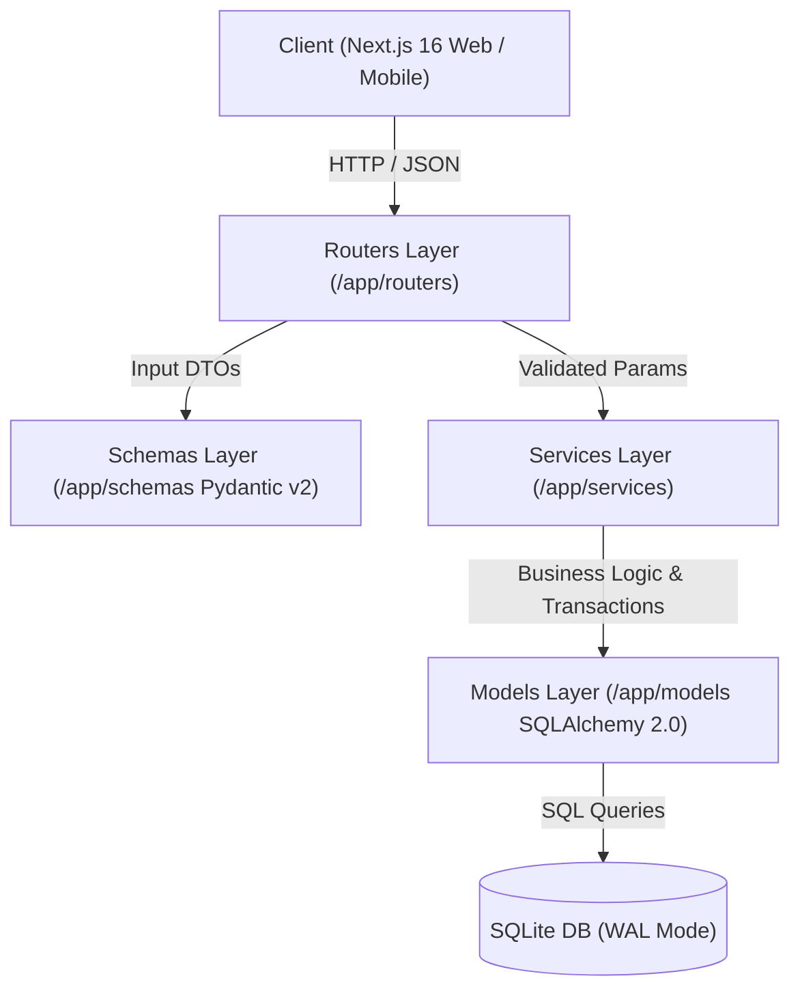
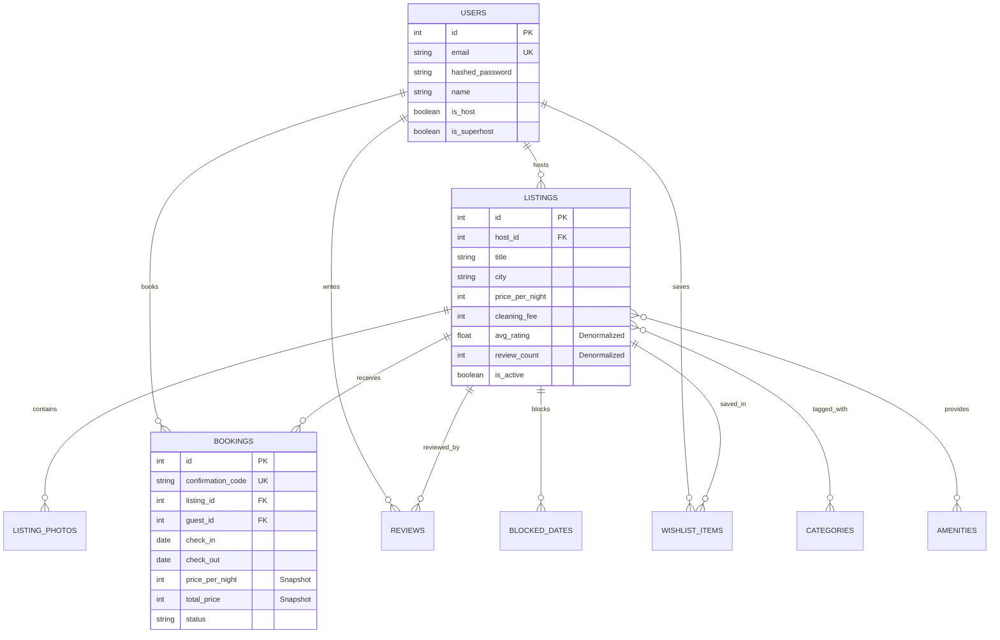

# Airbnb Full-Stack Clone

> An interview-grade, full-stack Airbnb clone built for high-performance property search, date-range availability calculations, atomic booking transactions, host management, and wishlist operations.

### 🌐 Live Production Deployment
- **Live Web Application:** [https://airbnb-clone-web-vd.azurewebsites.net](https://airbnb-clone-web-vd.azurewebsites.net)
- **Live Backend API (FastAPI / Swagger Docs):** [https://airbnb-clone-api-vd.azurewebsites.net/docs](https://airbnb-clone-api-vd.azurewebsites.net/docs)
- **API Health Check:** [https://airbnb-clone-api-vd.azurewebsites.net/api/health](https://airbnb-clone-api-vd.azurewebsites.net/api/health)

---

## 1. Overview & Tech Stack

This project is an authentic, production-ready clone of Airbnb designed against strict architectural, financial, and UX criteria.

```
┌───────────────────────────────────────────────────────────┐
│                     Next.js 16 (App Router)               │
│         React 19 • TypeScript • Tailwind CSS v3.4         │
└─────────────────────────────┬─────────────────────────────┘
                              │ HTTP / JSON API (Bearer JWT)
┌─────────────────────────────▼─────────────────────────────┐
│                    FastAPI (Python 3.11)                  │
│       Pydantic v2 • SQLAlchemy 2.0 • Layered Architecture │
└─────────────────────────────┬─────────────────────────────┘
                              │ ACID Engine
┌─────────────────────────────▼─────────────────────────────┐
│                    SQLite Database                        │
│            Strict Foreign Keys • PRAGMA Enforced          │
└───────────────────────────────────────────────────────────┘
```

### Technology Decisions

| Layer | Technology | Engineering Rationale |
|---|---|---|
| **Frontend** | **Next.js 16 (App Router)** | High-speed Turbopack compilation, hybrid server/client component decomposition, suspense boundaries for URL search params, and zero client hydration deopts. |
| **Styling** | **Tailwind CSS v3.4** | Pixel-accurate design system matching Airbnb specifications (`#FF385C` Rausch, `#222222` Ink, `#717171` Muted), customized rounded radii, and smooth micro-interactions. |
| **Backend** | **FastAPI (Python 3.11)** | High-throughput asynchronous framework with native type annotations, automatic OpenAPI (Swagger) generation, and clean dependency injection. |
| **Data Layer** | **SQLAlchemy 2.0** | Modern declarative ORM with strict typing, explicit relationship cascades, joined/selectin eager loading to avoid N+1 queries, and atomic transaction blocks. |
| **Validation** | **Pydantic v2** | Rust-backed schema validation for strict type checking, boundaries validation, and serialization. |
| **Database** | **SQLite 3** | Zero-configuration relational engine with WAL mode and runtime `PRAGMA foreign_keys = ON` enforcement. |

---

## 2. Quickstart & Local Setup

### Prerequisites
- **Python 3.11+**
- **Node.js 18+** & **npm**

---

### Step 1: Backend Setup

```bash
cd backend

# 1. Create and activate virtual environment
python3 -m venv .venv
source .venv/bin/activate    # On Windows: .venv\Scripts\activate

# 2. Install dependencies
pip install -r requirements.txt

# 3. Seed database with Indian luxury destinations & demo users
python -m app.seed.seed --reset

# 4. Run automated test suite
pytest -v

# 5. Start development server
uvicorn app.main:app --reload --port 8000
```
- Interactive API Documentation: [http://localhost:8000/docs](http://localhost:8000/docs)
- Health Check: [http://localhost:8000/api/health](http://localhost:8000/api/health)

---

### Step 2: Frontend Setup

```bash
cd frontend

# 1. Install dependencies
npm install

# 2. Configure environment (points to local FastAPI backend)
cp .env.example .env.local    # NEXT_PUBLIC_API_URL=http://localhost:8000

# 3. Start Next.js development server
npm run dev
```
Open [http://localhost:3000](http://localhost:3000) in your browser.

---

### Demo Accounts & 1-Click Role Switcher

The application features an instant **Demo User Switcher** in the navigation header account menu:

| Name | Email | Role | Pre-loaded Content |
|---|---|---|---|
| **Priya Sharma** | `priya.host@airbnb.test` | **Superhost** | Owns Listing #1 (Goan Luxury Beachfront Villa) + active reservations |
| **Arjun Mehta** | `arjun.host@airbnb.test` | **Host** | Owns urban apartments and heritage stays |
| **Ananya Iyer** | `ananya.guest@airbnb.test` | **Guest** | Active trips, completed past stays, and wishlists |
| **Rohan Verma** | `rohan.guest@airbnb.test` | **Guest** | New traveller profile |

---

## 3. System Architecture

The backend implements a clean **Separation of Concerns** using a 4-tier layered architecture:



### Layer Responsibilities
1. **Routers (`app/routers/`):** Pure HTTP handlers responsible for request routing, status codes, query parameter extraction, dependency injection (`get_db`, `get_current_user`, `get_current_host`), and response serialization.
2. **Services (`app/services/`):** Encapsulate all business logic, date calculations, pricing engines, availability queries, and multi-entity atomic transactions.
3. **Schemas (`app/schemas/`):** Strict Pydantic models for incoming request validation and response shapes.
4. **Models (`app/models/`):** SQLAlchemy declarative database models with explicit foreign keys, indexes, and relationship definitions.

---

## 4. Database Schema & Entity Relationships



### Key Engineering Decisions & Denormalizations

1. **Denormalized `avg_rating` & `review_count` on `Listing`:**
   - *Why:* Computing `AVG(rating)` and `COUNT(id)` across 1,000+ reviews on every search request with multi-attribute filtering creates severe I/O bottlenecks. Storing pre-aggregated values on `listings` turns search ordering and badge computation into an `O(1)` column read.
   - *Maintenance:* Recalculated atomically whenever a new review is inserted.

2. **Price Snapshotting on `Booking`:**
   - *Why:* Hosts modify nightly rates, seasonal pricing, and cleaning fees frequently. A booking represents an immutable legal contract.
   - *Implementation:* The exact `price_per_night`, `cleaning_fee`, `service_fee`, and `total_price` are captured at the moment of reservation and persisted directly on the `Booking` record.

3. **Integer Currency Handling (INR):**
   - *Why:* Floating-point arithmetic (`0.1 + 0.2 = 0.30000000000000004`) causes critical accounting errors. All rates, fees, taxes, and totals are computed and stored as server-side integers in Indian Rupees (`₹`).

---

## 5. Booking Availability & Race Condition Engine

### Overlap Algorithm
Availability checking strictly allows **adjacent bookings** (where Guest A checks out in the morning and Guest B checks in that afternoon).

Two date ranges `[A_in, A_out]` and `[B_in, B_out]` conflict if and only if:
$$\text{Existing.check\_in} < \text{New.check\_out} \quad \text{AND} \quad \text{Existing.check\_out} > \text{New.check\_in}$$

```
Case 1: Conflict (Overlap)
Existing:  [======== Stay A ========]
New Stay:         [======== Stay B ========]  -> REJECTED (409 Conflict)

Case 2: Adjacent Stay (Valid Check-out / Check-in)
Existing:  [======== Stay A ========] (Check-out: Nov 10)
New Stay:                           [======== Stay B ========] (Check-in: Nov 10) -> ACCEPTED
```

### Atomic Concurrency Control
- All booking creation operations run inside an atomic database transaction.
- When a booking is requested, active reservations and blocked dates are evaluated in the same transaction block before the booking is inserted, preventing race-condition double bookings.

---

## 6. API Reference Catalog

| Category | Method | Path | Summary | Auth |
|---|---|---|---|---|
| **Health** | `GET` | `/api/health` | Service health status | Public |
| **Auth** | `POST` | `/api/auth/login` | Email login / JWT generation | Public |
| | `GET` | `/api/auth/me` | Current user profile | Bearer Token |
| | `GET` | `/api/auth/demo-users` | Demo user accounts list | Public |
| **Listings** | `GET` | `/api/listings` | Paginated search & filter listings | Public |
| | `GET` | `/api/listings/{id}` | Full listing detail with photos & host | Public |
| | `GET` | `/api/listings/{id}/quote` | Computed pricing breakdown | Public |
| | `GET` | `/api/listings/{id}/availability`| Reserved and blocked calendar dates | Public |
| | `GET` | `/api/listings/{id}/reviews` | Paginated reviews & rating breakdown | Public |
| **Bookings** | `POST` | `/api/bookings` | Create atomic reservation | Guest / User |
| | `GET` | `/api/bookings/me` | User's upcoming and past trips | Guest / User |
| | `POST` | `/api/bookings/{id}/cancel` | Cancel reservation | Booking Owner |
| **Host** | `GET` | `/api/host/listings` | Host-owned listings & metrics | Host Only |
| | `POST` | `/api/host/listings` | Create property via multi-step wizard| Host Only |
| | `PATCH`| `/api/host/listings/{id}` | Update listing details or active state| Host Only |
| | `DELETE`|`/api/host/listings/{id}` | Soft/hard delete listing | Host Only |
| | `GET` | `/api/host/reservations` | Reservations across host properties | Host Only |
| | `PUT` | `/api/host/listings/{id}/blocked-dates` | Block calendar dates | Host Only |
| **Wishlist**| `GET` | `/api/wishlist` | Full property cards in user wishlist| Guest / User |
| | `GET` | `/api/wishlist/ids` | Saved IDs list for fast heart badges | Guest / User |
| | `POST`| `/api/wishlist/{id}` | Save listing to wishlist | Guest / User |
| | `DELETE`|`/api/wishlist/{id}`| Remove listing from wishlist | Guest / User |
| **Metadata**| `GET` | `/api/categories` | Listing categories | Public |
| | `GET` | `/api/amenities` | Listing amenities with icon keys | Public |
| | `GET` | `/api/locations/suggest` | Location suggestions for search bar | Public |

---

## 7. Feature Checklist

- [x] **Universal Navigation Shell:** 80px sticky header with scroll-collapse search pill, 1-click Demo Switcher, and responsive mobile bottom navigation.
- [x] **Decomposed Search Engine:** Expanded 3-panel search popover (Where / When / Who) with location autosuggest, interactive date picker, and guest steppers.
- [x] **Filters & Interactive Map:** Multi-criteria filter modal (price slider, room/property types, amenities) and interactive Leaflet map with custom INR price badge pills.
- [x] **Rich Listing Detail (`/rooms/[id]`):** 5-photo mosaic with full-screen gallery viewer, host profile, 6-axis rating score bars, expandable amenities, and sticky booking card with live pricing quote.
- [x] **End-to-End Booking Checkout (`/book/[id]`):** Guest details, ground rules, cancellation policy, live price calculation, and unique `HM...` confirmation code generation.
- [x] **Trips Dashboard (`/trips`):** Upcoming vs past stays, confirmation cards, and self-service booking cancellation modal.
- [x] **Host Management (`/host`):** Performance metrics (listings, reservations, gross revenue, star rating), listings table with active/unlisted toggle, and host reservations view.
- [x] **Multi-Step Host Listing Wizard (`/host/new`):** 5-step flow (Basics → Location → Photos → Amenities → Pricing & Live Preview) with validation and progress tracking.
- [x] **Wishlists Hub (`/wishlists`):** Optimistic heart toggles and dedicated saved stays dashboard.
- [x] **UI Polish & Resilience:** App-wide toast notifications, unified zero-layout-shift skeleton loaders, mobile bottom-bar, custom 404 page, and client error boundary.

---

## 8. Deployment & Cloud Architecture

### Azure Production Architecture
- **Frontend App Service:** [https://airbnb-clone-web-vd.azurewebsites.net](https://airbnb-clone-web-vd.azurewebsites.net)
- **Backend API App Service:** [https://airbnb-clone-api-vd.azurewebsites.net](https://airbnb-clone-api-vd.azurewebsites.net)
- **Container Registry (ACR):** `airbnbcloneacr.azurecr.io`
- **Database:** Azure Database for PostgreSQL Flexible Server (`airbnb_clone` with RBAC tables & automated seeds)
- **CI/CD:** GitHub Actions workflows (`.github/workflows/ci.yml`, `release-tag.yml`, `azure-deploy.yml`) for automated testing, linting, Docker image building, and continuous deployment to Azure.

### Docker Multi-Stage Build
Both frontend and backend are containerized with optimized multi-stage `Dockerfile` and `docker-compose.yml`:
```bash
# Build and run entire stack locally with Docker Compose
docker compose up --build
```

---

## 9. Assumptions & Trade-Offs

1. **Mocked Authentication:** Uses standard Bearer JWTs without email confirmation or SMS OTPs. A 1-click Demo User Switcher is provided to make evaluation immediate and painless.
2. **Mocked Payments:** Credit card and UPI processing are simulated; bookings transition to `CONFIRMED` upon checkout completion.
3. **Database Choice:** SQLite was selected for zero-dependency local evaluation and fast testing. In a hyper-scale deployment, PostgreSQL with PostGIS and Redis would be used.
